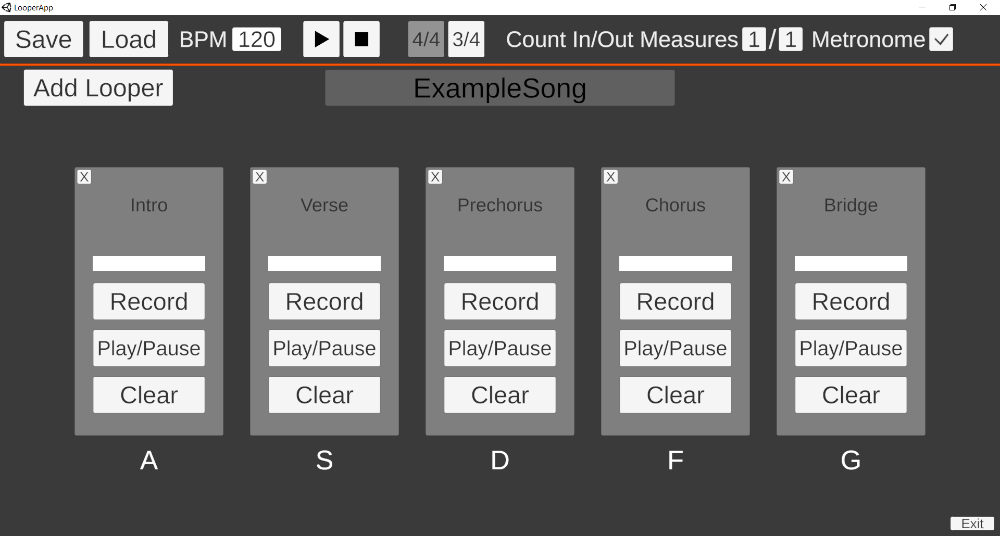

# Looper App
**Digital Loop Station Built In Unity**

## App Features
- Record loops with precise rhythmic timing
- Change beats per minute (BPM)
- Enable/Disable metronome
- Change measure count in/out for starting and ending loop recording
- Choose between 4/4 time and 3/4 time
- Title loops and loop session
- Simultaneously play/stop all loops
- Hotkeys for playing/stopping loops
- Save loop session and load previous loop sessions
- Loops saved as WAV files
- Use up to 5 loopers 

### Acknowledgement
For this project I used the SavWav.cs script created by GitHub user darktable to convert audio clips to WAV files.

## Motivation 
As a guitarist, I have always been fascinated by artists like Ed Sheeran who use loop stations to recreate their hit songs live in front of audiences. Unfortunately, loop pedals alone cost way more than I am willing spend. This is what inspired me to attempt and make my own digital loop station.
## The Development Process
I attempted to build a digital loop station last year using Python. I had recently used Python in another project so the language was the first to come to mind. I learned about how to create GUI using the Tkinter module. I also learned about using threads. The issue that led to me scrapping the project was that the loops quickly got out of sync. I was not correctly accounting for the time that the sounds took to be processed before they were played. I did not have the time and patience to try and fix the issue so I called it quits.

Jumping forward to this year, I was thinking about coding projects that I could complete over Winter Break and the loop station idea came back to me. This time I knew that I had to focus on making sure that the loops stayed in sync. I also had a new year of coding knowledge under my belt, so my confidence was high. I decided to build the application in Unity since it is what I have the most experience with and it offers an easy GUI solution. 

The greatness of Unity was revealed when I discovered the Audio settings and functions provided by Unity itself. Unity allows developers to access the current time of the Audio engine which is much more precise than the time provided by the game engine. Unity also gives the developers the ability to schedule a sound to play or stop at a future time. This was great for making sure that the loops started and stopped at specific beats.

One issue that I faced was getting a single audio clip to actually loop. Unity's AudioSource component has a looping feature which does what it is supposed to. However, due to the digital, no foot pedal, setup that I have, I have to trim down each audio clip to fit into a variable amount of musical bars. It is impossible to trim the clip perfectly, so the clip may begin a little bit later or end a little bit earlier than I want it to. If the clip was allowed to loop, it would get out of sync with the metronome very quickly. My fix for this was to have each digital loop pedal have two AudioSource components containing the same clip. To simulate looping, I schedule each clip to play at the time that the other clip should end if it was trimmed correctly. This solution of alternating duplicate audio clips keeps the music in sync. I am very happy with how this application turned out.
